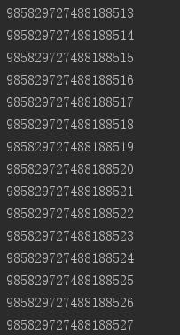
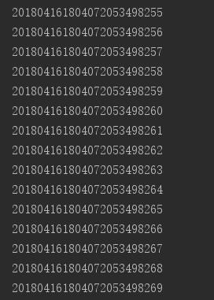

# SnowFlake
由于项目需求，参照网上一些开源资料，封装了<strong>ID</strong>和<strong>订单编码</strong>的生成。

高效GUID产生算法(sequence),基于Snowflake实现64位自增ID算法。

Twitter-Snowflake算法产生的背景相当简单，为了满足Twitter每秒上万条消息的请求，每条消息都必须分配一条唯一的id，这些id还需要一些大致的顺序（方便客户端排序），并且在分布式系统中不同机器产生的id必须不同。

## Snowflake算法核心
把时间戳，工作机器id，序列号组合在一起。


## Maven
 ```
 <dependency>
     <groupId>com.github.babylikebird</groupId>
     <artifactId>com.snowflake.id</artifactId>
     <version>0.0.1</version>
 </dependency>
```

## 获取ID


## 获取订单号

